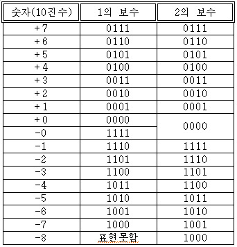
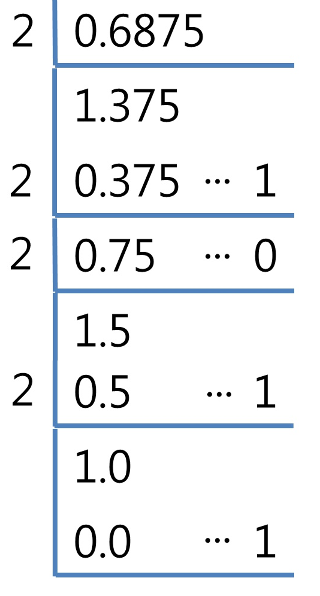
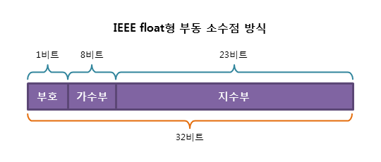
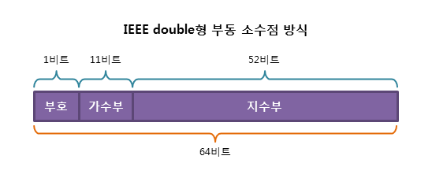
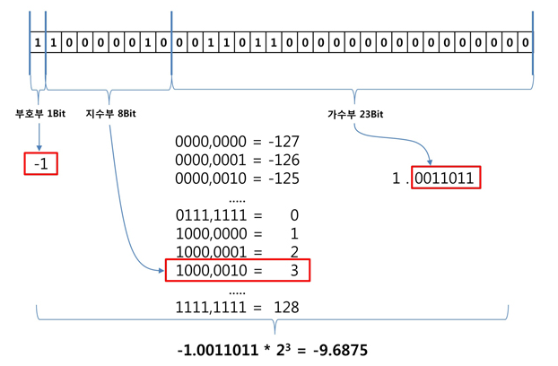
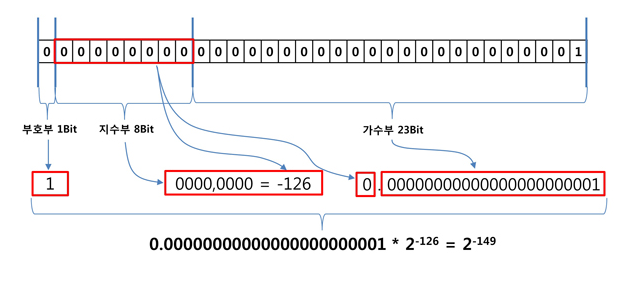
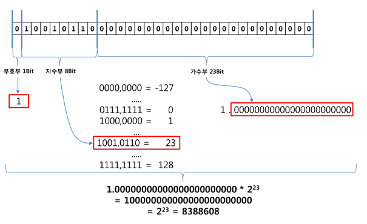

# Decimal 
## 2의 보수법
<div style="text-align:center" markdown="1">



</DIV>

2의 보수는 각 비트를 반전시킨 후에 1을 더한 것
1의 보수를 사용 했을 경우 위의 사진과 같이 +0, -0이 생기는 문제가 발생.
- 유일한 0을 만들기 위해 
- 또한, Accumulator 작성에 유리함
>Example
>- 1의 보수 : 4 + (-3) 의 경우
>   - 0100 + 1011 = 1111?
>- 2의 보수 : 4 + (-3) 의 경우
>   - 0100 + 1101 = (1)0001

****
## 데이터 모델

int 는 몇 바이트 일까?
long 은 몇 바이트 일까?
범위를 좁혀서 64-bit Linux 에서 int, long 은 몇 바이트 일까? 

데이터 타입은 항상 일정하지는 않다
long 의 경우, 윈도우즈 에서는 4바이트 이고, 리눅스에서는 8바이트 이다.
플랫폼 별로 데이터 모델이 다르기 때문.

|Data Model | char |short | int | long | long long | pointer | Operating System |
|---|---|---|---|---|---|---|---|
| ILP32 | 8 | 16 | 32 | 32 | 64 | 32 | Microsoft Windows (x86-64 and IA-64) using Visual C++; and MinGW, Most Unix and Unix-like systems |
| LLP64, IL32P64 | 8 | 16 | 32 | 32 | 64 | 64 | Microsoft Windows (x86-64 and IA-64) using Visual C++; and MinGW  |
| LP64, I32LP64 | 8 | 16 | 32 | 64 | 64 | 64 | Most Unix and Unix-like systems, e.g., Solaris, Linux, BSD, macOS. Windows when using Cygwin; z/OS |
| ILP64 | 8 | 16 | 64 | 64 | 64 | 64 | HAL Computer Systems port of Solaris to the SPARC64 |
| SILP64 | 8 | 64 | 64 | 64 | 64 | 64 | Classic UNICOS (versus UNICOS/mp, etc.) |

x86 32비트 시스템에서는 윈도우, 리눅스 모두 ILP32모델을 사용했지만 64비트로 넘어오면서 차이가 발생

ILP32 의 경우 int, long, pointer가 32비트 라는 뜻
LP64의 경우 long, pointer가 64비트 LLP64의 경우 long, long, pointer가 64비트라는 의미
특수한(SILP64) 경우가 아닌 char, short, long long은 그 크기가 (8, 16, 64)로 일정
int, long, pointer는 모델에 따라 달라지므로 주의

****

## 부동소수점

### 고정소수점과 부동소수점
- 고정소수점은 소수점의 위치를 고정 하는것
- 부동소수점이란 실수를 표현할 때 소수점의 위치를 고정 하지 않는것
  
고정 소수점의 경우 한정된 비트에 고정소수점의 경우 정수부분과 소수부분을 나누어 표현해야 할 경우 고정소수점이 나타낼 수 있는 범위가 한정된다.
예를 들어 123.456 의 경우 정수부분 123과 소수부분 456을 나누어서 표현해야 함

부동소수점의 경우 123.456을 123456이라는 유효숫자부와 3이라는 소수점 위치를 통해서 고정소수보다 훨씬 넓은 범위의 수를 표현 할 수 있음

### 부동소수점 계산
정수는 '2의 보수법' 을 통해 2진법으로 표기 소수는?

- 실수를 2진법으로 표현하는 법
> 10진수 -9.6875를 2진법으로 나타내는 방법
> 
> 정수 9와 소수 0.67875 나누어 계산
> 정수 9는 2진수로 1001
> 소수부분의 경우 2를 곱해서 정수 부분을 취하면 된다.
> 
> 
> 
> 소수 부분에 2를 곱한 후, 결과가 1을 넘을 경우 1을 빼고 각 단계 정수 부분을 얻어 낸다.
> 일반적인 소수의 경우 실수는 무한히 반복되므로 적당한 개수의 유효숫자만 취하게 된다.
> -9.6785를 2진법으로 표현하면 -1001.1011 이 됨

### 부동소수점 구조
-9.6875는 2진법으로 -1001.1011으로 표현된다
-1001.1011을 저장하는 방법은?
부동소수점을 표현하기 위하여 정규화 과정을 거치는데, 지수를 이용하여 실수를 표현하는 것.
-1001.1011를 정규화할 경우 -1.0011011 * 2³ 이 된다.
정규화란 정수부를 1로 맞추고, 소수점의 위치를 적절하게 변경하는 것

부호부 : 음수
지수부 : 2³ 보통 승수인 3
가수부 : 0011011

일반적으로 C/C++, JAVA의 경우 부동소수점으로 float(32bit), double(64bit)타입을 제공




#### bias 표현법
부동소수점을 사용하므로써, -127 ~ 128승 수의 값까지 표현 가능
정수를 표현하기 위해서 2의 보수법을 사용하할 것 같지만 그렇지 않고 bias 표현법을 사용한다.



-127의 경우 000,000 -126은 000,0001 0은 0111,1111 1은 1000,0000 이된다.
이러한 표현법을 바이어스 표현법이라고 하는데, 이런 구조를 택한 이유는 순수한 0을 표시하기 위함
일반적인 방법(2의 보수법)으로 기본값을 0으로 처리 했다면, 2의 0승이 되어 1.0000.... * 2^0 으로 1이 되어 버린다.
바이어스 표현법을 사용할 경우, 모든 비트가 0일 경우 순수하게 0을 표시하게 됨

실제 -9.6875를 float으로 나타내면 다음과 같다
> [부호부 음수, 지수부 3, 가수부 0011011]
> 지수부 3이므로 -127을 1로 삼을 경우 130
> 즉, 130을 2진법으로 나타내면 [1000,0010]
> [1][10000010][00110110000000000000000]

[float 확인]
```CPP
int main(void){
    unsigned int ui = 0xC11B0000;

    float f;
    memcpy(&f, &ui, 4);

    cout << f << endl;
    return 0;
}
```
[출력결과]
```CPP
-9.6875
```

#### 모든 비트가 0으로 채워진 경우
모든 비트가 0으로 채워진 경우 지수부는 -127 즉 (1/2<sup>127</sup>)
매우 작은 수지만 0은 아님, 그럼 -127을 0으로 지정할 경우, -127보다 작은 수를 표현 할 수 없다.
그래서 지수부가 -127인 경우에는 유효숫자 정수부를 1에서 0으로 처리
즉, 지수부가 모두 0인 경우는 -127이 아닌 -126 따라서 실제 표현 가능한 지수부는 -126 ~ 128

위의 규칙을 적용하면 float 는 더 작은 수를 표현 할 수 있다.
- 지수부가 모두 0이고, 가수부 마지막 비트만 1인 경우


#### 부동소수점 표현의 한계

float나 double의 경우 가수부의 크기가 일정하기 때문에, 지수가 클 경우, 소수점 이하를 표현하지 못함



지수부의 지수가 23 즉, 가수부의 bit수를 넘어갈 경우 소수점이 오른쪽으로 23이상 이동하게 되므로 더 이상 소수점 이하 부분이 남아있지 않게 된다.
실제 위의 그림에서 가수부가 모두 0일 경우를 계산할 경우 10진수로 8,388,608이 된다. 즉 8,388,608이상을 나타낼 때는 더 이상 소수점 이하를 표현 할 수 없다.

[float 소수 표현의 한계]
```CPP
int main()
{
    float f[10];
    f[0] = 8388608.0f;
    f[1] = 8388608.1f;
    f[2] = 8388608.2f;
    f[3] = 8388608.3f;
    f[4] = 8388608.4f;
    f[5] = 8388608.5f;
    f[6] = 8388608.6f;
    f[7] = 8388608.7f;
    f[8] = 8388608.8f;
    f[9] = 8388608.9f;
    
    cout.precision(32);
    for(int i = 0; i < 10 ; i++)
    {
        cout << f[i] << endl;
    }
    
    return 0;
}
```

[출력결과]
```CPP
8388608     // (1)
8388608
8388608
8388608
8388608
8388608
8388609     // (2)
8388609
8388609
8388609
```
float은 8388608 이상에서 소수 부분을 표현할 수 없기 때문에, 가장 근사한 정수값을 선택하게 됨
이런 과정에서 부동소수점은 오차를 가질 수 밖에 없다.

지수부가 커질 수록 오차의 범위는 커진다.
지수가 25인 경우, 소수점을 25만큼 오늘쪽으로 이동하면 끝자리 00 두자리가 남게 되고, 4의 배수가 된다
33,554,432 이상의 수를 float으로 표현할 경우 오직 4의 배수만을 나타낼 수 있다.

[float 4의 배수만 표현]
```CPP
int main()
{
    float f[10];
    f[0] = 33554432;
    f[1] = 33554433;
    f[2] = 33554434;
    f[3] = 33554435;
    f[4] = 33554436;
    f[5] = 33554437;
    f[6] = 33554438;
    f[7] = 33554439;
    f[8] = 33554440;
    f[9] = 33554441;
    
    cout.precision(32);
    for(int i = 0; i < 10 ; i++)
    {
        cout << f[i] << endl;
    }
    
    return 0;
}
```

[출력결과]
```CPP
33554432
33554432
33554432
33554436
33554436
33554436
33554440
33554440
33554440
33554440
```
지수가 커질수록 오차 또한 급격히 커진다. float의 경우 지수를 128까지 표현 가능 하기 때문에, 2의 배수씩 커지게 된다.

### INF & NaN
IEEE754 부동 소수점은 특별한 것을 표현 할 수 있도록 추가적인 규정을 만들어 놓음
- 무한 (Infinity)과 NaN (Not a Number)

NaN은 미정의 결과, 값이 없는 상태를 나타냄
지수부의 모든 비트가 1로 채워진 상태인 128이 무한과 NaN에 대한 예약어로 사용 된다.
실제 지수범위는 -126~127
지수부는 128이고 가수부의 모든 비트가 0일 경우 무한을 나타내며
가수부 비트 중 하나라도 1이 있을 경우는 NaN을 나타내게 됨
- [0111,1111,1000,0000,0000,0000,0000] => 0x7F80,0000

[float의 무한 표현]
```CPP
int main(void){
    unsigned int ui = 0x7F800000;
    
    float f;
    memcpy(&f, &ui, 4);
    
    cout << f << endl;
    
    float f2 = f + f;
    cout << f2 << endl;
    
    ui = 0xFF800000;
    
    memcpy(&f, &ui, 4);    
    cout << f << endl;
    
    f2 = f + f;
    cout << f2 << endl;
    
    return 0;
}
```

[출력 결과]
```CPP
inf
inf
-inf
-inf
```
컴파일러마다 출력값이 다를 수 있다.
무한과 무한을 더해도 값은 무한일 뿐

NaN을 표현하는 가장 간단한 방법은 모든 비트를 1로 채우는 것
0xFFFF,FFFF

[float의 NaN 표현]
```CPP
int main(void){
    unsigned int ui = 0x7FFFFFFF;
    
    float f;
    memcpy(&f, &ui, 4);
    
    cout << f << endl;
    
    float f2 = f + f;
    cout << f2 << endl;
    
    ui = 0xFFFFFFFF;
    
    memcpy(&f, &ui, 4);    
    cout << f << endl;
    
    f2 = f + f;
    cout << f2 << endl;
    
    return 0;
}
```

[출력 결과]
```CPP
nan
nan
-nan
-nan
```

## 정리
- 부동소수점은 아주 작은 수와 아주 큰 수, 그리고 무한과 NaN을 표현하기 위해 도입된 타입
- 표현의 한계로 인해 값이 커질 수록 오차의 범위도 증가함
- 정수 계산은 정수 타입에 맡기고, 정밀한 계산을 위해서라면 계산 전용 라이브러리를 이용하는게 낫다
- 부동소수점을 사용해야 한다면, float 보다 double을 쓰자
